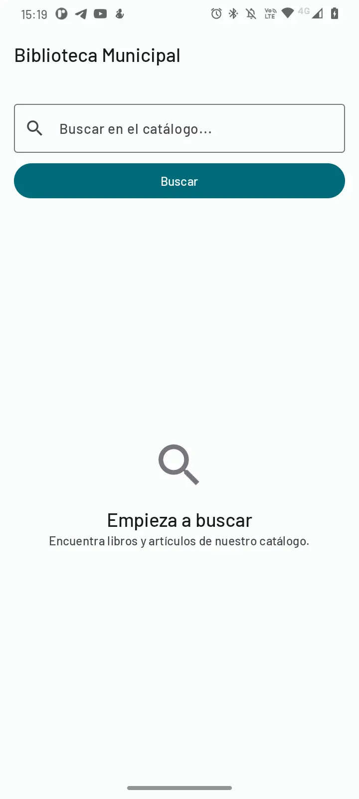
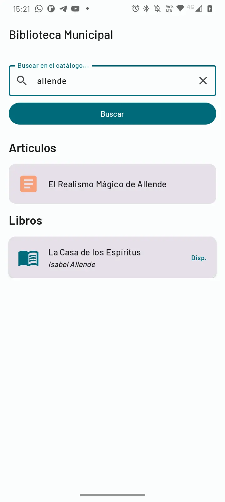
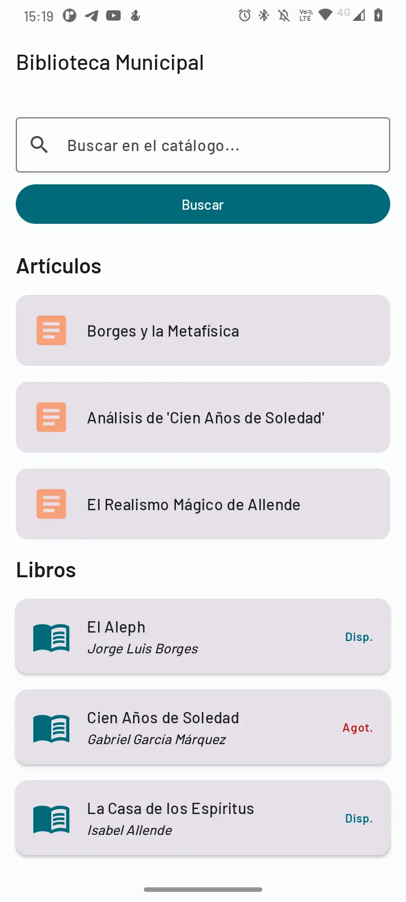
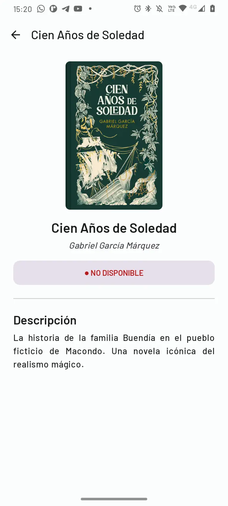
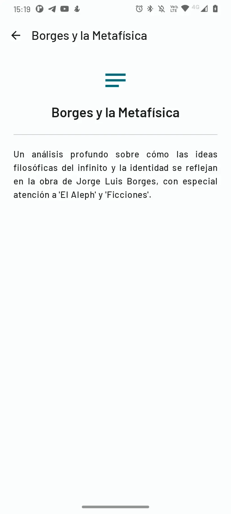
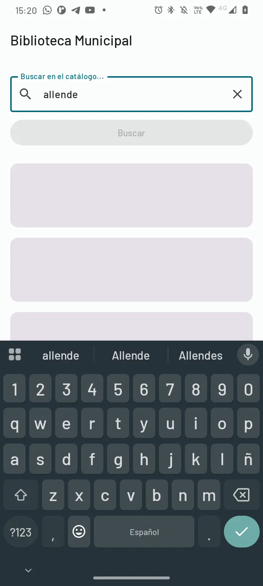

<p align="center">
  
</p>

# 📚 Biblioteca Municipal - Sistema de Búsqueda Asíncrona


<div align="center">



**Aplicación Android moderna para la gestión y búsqueda de catálogos bibliográficos**

[](https://kotlinlang.org)
[](https://developer.android.com/jetpack/compose)
[](https://kotlinlang.org/docs/coroutines-overview.html)

</div>

---

## 🎯 Descripción del Proyecto

Sistema desarrollado para la **Municipalidad** con el objetivo de modernizar el acceso a la biblioteca pública. La aplicación permite a los usuarios buscar libros y artículos por título o autor, consultar disponibilidad en tiempo real, y navegar por el catálogo completo de manera fluida y eficiente.

### 🌟 Características Principales

- **🔍 Búsqueda Inteligente**: Sistema de búsqueda por título o autor con filtrado en tiempo real
- **⚡ Operaciones Asíncronas**: Implementación completa de Kotlin Coroutines para experiencia fluida
- **📱 UI Moderna**: Interfaz Material Design 3 con Jetpack Compose
- **🔄 Búsquedas Paralelas**: Consultas simultáneas a múltiples fuentes de datos
- **💾 Gestión de Catálogo**: Visualización de libros y artículos académicos
- **✅ Indicadores de Disponibilidad**: Estado en tiempo real de cada recurso

---

## 🖼️ Capturas de Pantalla

<div align="center">

### Pantalla de Búsqueda


*Interfaz principal con campo de búsqueda y resultados en tiempo real*

---

### Catálogo Completo


*Vista completa del catálogo con libros y artículos disponibles*

---

### Detalles de Libro


*Vista detallada con portada, descripción y estado de disponibilidad*

---

### Detalles de Artículo


*Vista de artículos académicos con contenido completo*

---

### Estados de Carga


*Indicadores de progreso durante operaciones asíncronas*

</div>

---

## 🏗️ Arquitectura y Tecnologías

### 📐 Patrón de Arquitectura
- **MVVM (Model-View-ViewModel)**
- **Repository Pattern** para abstracción de datos
- **Unidirectional Data Flow** con StateFlow

### 🛠️ Stack Tecnológico

| Tecnología | Propósito |
|------------|-----------|
| **Kotlin** | Lenguaje principal |
| **Jetpack Compose** | UI moderna y declarativa |
| **Kotlin Coroutines** | Programación asíncrona |
| **StateFlow** | Gestión de estado reactivo |
| **Navigation Compose** | Navegación entre pantallas |
| **Material Design 3** | Sistema de diseño |
| **ViewModel** | Gestión de lógica de UI |
| **Coil** | Carga de imágenes |

---

## ⚙️ Implementación de Coroutines

### 🎓 Funciones Obligatorias Implementadas

El proyecto cumple con **todos** los requisitos técnicos de programación asíncrona:

#### 1️⃣ **launch**
```kotlin
// Inicia la corrutina sin bloquear el hilo principal
viewModelScope.launch {
    _uiState.update { it.copy(isLoading = true) }
    // Operaciones asíncronas...
}
```

#### 2️⃣ **async**
```kotlin
// Búsquedas paralelas para optimizar tiempo de respuesta
val librosDeferred = async { libroRepository.buscarLibros(query) }
val articulosDeferred = async { articuloRepository.buscarArticulos(query) }
```

#### 3️⃣ **withContext**
```kotlin
// Cambio explícito al hilo de fondo (IO Dispatcher)
val (librosResult, articulosResult) = withContext(Dispatchers.IO) {
    // Operaciones de red/BD aquí
}
```

#### 4️⃣ **await**
```kotlin
// Espera de resultados paralelos sin bloquear
librosDeferred.await() to articulosDeferred.await()
```

### 🧵 Gestión de Hilos

- **Main Thread (UI Thread)**: Actualizaciones de UI, renderizado
- **Background Thread (Dispatchers.IO)**: Operaciones de red y base de datos
- **Cambio Automático**: `withContext` retorna al Main Thread automáticamente

### 📊 Simulación de API REST

```kotlin
// LibroRepository.kt
suspend fun buscarLibros(query: String): List<Libro> {
    delay(2000) // Simula latencia de red
    return catalogoDeLibros.filter { /* filtrado */ }
}
```

---

## 🔄 Ciclo de Vida y Cancelación

### ✅ Gestión Automática con viewModelScope

```kotlin
class BusquedaViewModel : ViewModel() {
    // viewModelScope se cancela automáticamente en onCleared()
    fun buscar() {
        viewModelScope.launch {
            // Esta corrutina se cancelará si el usuario sale de la pantalla
        }
    }
}
```

**Ventajas:**
- ✅ Cancelación automática en `onDestroy()`
- ✅ Prevención de memory leaks
- ✅ No es necesario gestionar Jobs manualmente

---

## 📂 Estructura del Proyecto

```
📦 biblioteca
├── 📁 data
│   └── 📁 model
│   |   ├── Articulo.kt
│   |   └── Libro.kt
│   └── 📁 repository
│       ├── ArticuloRepository.kt
│       └── LibroRepository.kt
├── 📁 navigation
│   └── AppNavigation.kt
├── 📁 ui
│   └── 📁 theme
│       ├── Color.kt
│       ├── Theme.kt
│       └── Type.kt
├── 📁 view
│   ├── 📁 components
│   │   ├── ArticuloCard.kt
│   │   └── LibroCard.kt
│   └── 📁 screens
│       ├── ArticuloScreen.kt
│       ├── BusquedaScreen.kt
│       └── LibroScreen.kt
├── 📁 viewmodel
│   └── BusquedaViewModel.kt
└── MainActivity.kt
```

---

## 🚀 Requisitos del Sistema

- **Android Studio**: Hedgehog | 2023.1.1 o superior
- **Kotlin**: 1.9+
- **Gradle**: 8.0+
- **Android SDK**: MinSDK 24 (Android 7.0) - TargetSDK 34

---

## 📥 Instalación y Ejecución

### 1️⃣ Clonar el Repositorio
```bash
git clone https://github.com/yerkoppp/AppBiblioteca.git
cd biblioteca
```

### 2️⃣ Abrir en Android Studio
- Abrir Android Studio
- File → Open → Seleccionar carpeta del proyecto
- Esperar sincronización de Gradle

### 3️⃣ Ejecutar la Aplicación
- Conectar dispositivo Android o iniciar emulador
- Click en el botón Run ▶️
- Seleccionar dispositivo destino

---

## 🎨 Características de UI/UX

### 🎭 Estados de la Aplicación

| Estado | Descripción |
|--------|-------------|
| **InitialState** | Pantalla de bienvenida con instrucciones |
| **LoadingState** | Skeleton screens durante carga |
| **ResultsList** | Visualización de resultados |
| **NoResultsState** | Mensaje amigable sin resultados |
| **ErrorState** | Manejo de errores con feedback |

### 🌈 Paleta de Colores

- **Primary**: `#006A7A` (Azul verdoso)
- **Secondary**: `#F79F79` (Naranja ocre)
- **Tertiary**: `#B2C5B3` (Verde grisáceo)
- **Error**: `#BA1A1A` (Rojo)

---

## 📊 Datos de Prueba

### 📚 Catálogo de Libros (5 títulos)
- El Aleph - Jorge Luis Borges
- Cien Años de Soledad - Gabriel García Márquez
- La Casa de los Espíritus - Isabel Allende
- Ficciones - Jorge Luis Borges
- Rayuela - Julio Cortázar

### 📄 Artículos Académicos (3 títulos)
- Borges y la Metafísica
- Análisis de 'Cien Años de Soledad'
- El Realismo Mágico de Allende

---

## 🧪 Casos de Prueba Recomendados

1. **Búsqueda por Autor**
   - Buscar "Borges" → Debe retornar 2 libros + 1 artículo

2. **Búsqueda por Título**
   - Buscar "Soledad" → Debe retornar 1 libro + 1 artículo

3. **Catálogo Completo**
   - Dejar campo vacío → Debe mostrar todos los recursos

4. **Navegación**
   - Click en tarjeta → Debe navegar a pantalla de detalle
   - Botón "Volver" → Debe retornar a búsqueda

5. **Estados de Carga**
   - Verificar ProgressBar durante búsqueda
   - Verificar skeleton screens

---

## 📝 Requisitos Cumplidos (AE4)

### ✅ Checklist de Requisitos Técnicos

- [x] Uso obligatorio de **Kotlin Coroutines**
- [x] Función `launch` implementada
- [x] Función `async` implementada
- [x] Función `withContext` implementada
- [x] Función `await` implementada
- [x] Separación Main Thread / Background Thread
- [x] Simulación de API REST con `delay()`
- [x] ProgressBar durante búsquedas
- [x] Manejo de Job y cancelación
- [x] Documentación en código

### ✅ Checklist de Requisitos Funcionales

- [x] Búsqueda por palabras clave
- [x] Consultas asíncronas
- [x] Resultados en lista
- [x] No afecta experiencia de uso
- [x] Manejo del ciclo de vida
- [x] Cancelación al abandonar pantalla

---

## 👨‍💻 Autor

**Yerson Osorio**
- GitHub: [@yerkoppp](https://github.com/yerkoppp)

---

## 📄 Licencia

Este proyecto fue desarrollado como parte de la actividad evaluativa AE4 - ABPRO1 sobre Arquitectura y Ciclo de Vida de Componentes Android, con enfoque en Programación Asíncrona.

---

## 🙏 Agradecimientos

- **Municipalidad** por confiar en este desarrollo
- **Kotlin Community** por la excelente documentación de Coroutines
- **Google** por Jetpack Compose y Material Design 3

---

<div align="center">

**⭐ Si este proyecto te fue útil, considera darle una estrella ⭐**

*Desarrollado con ❤️ usando Kotlin y Jetpack Compose*

</div>